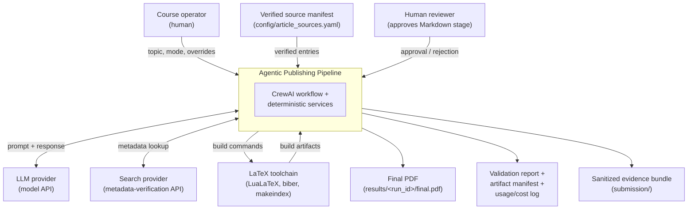
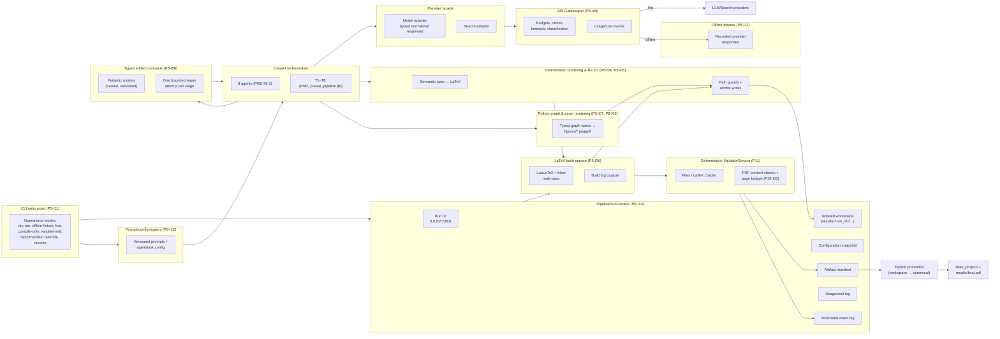
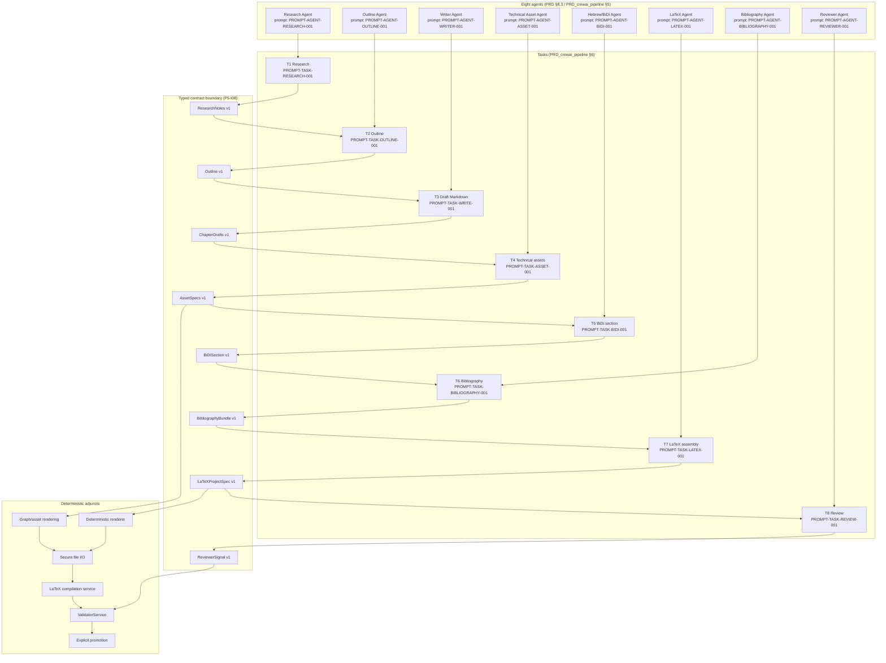

# C4 views — agentic-publishing-pipeline

> **Status:** Phase 4 design amendment (P4-I04). Documentation-only.

This document records the system-context (C4 Level 1), container
(C4 Level 2), and component (C4 Level 3) views of the planned runtime.
The runtime is **not implemented**; this is design scope only.

The diagrams below are intentionally aligned with the eight agents and
eight tasks specified in `docs/PRD_crewai_pipeline.md` §5–§6 and with the
deterministic `ValidatorService` boundary in
`docs/PRD_pdf_validation.md`.

---

## 1. System context (C4 Level 1)

The system context view shows the publishing pipeline as a single
software system that consumes external inputs (topic, source manifest,
provider/search APIs, LaTeX toolchain) and produces external outputs
(LaTeX project, final PDF, validation report, evidence bundle).

### Boundaries

- **In scope of the system:** the CrewAI orchestration, agents and tasks,
  provider facade, API Gatekeeper, deterministic renderer, LaTeX
  compilation service, Python graph/asset rendering, deterministic
  `ValidatorService`, run workspace, prompt/config registry, and the
  artifact promotion machinery.
- **Out of scope:** the LLM provider, the search provider, the LaTeX
  distribution, and Moodle submission.

---

## 2. Container view (C4 Level 2)

The container view decomposes the system into the long-lived runtime
containers. Every container has an owner, an authoritative configuration
source, an allowed root for side effects, and an explicit boundary
between LLM-authored content and deterministic processing.

### Container responsibilities

| Container | Owner / authority | Allowed root for writes | Side effects |
|---|---|---|---|
| CLI entry point | Operator | none directly | starts the run, selects mode, passes overrides |
| `PipelineRunContext` | Deterministic code | `results/<run_id>/` | creates run ID, workspace, config snapshot, event log, usage log, artifact manifest |
| Prompt/config registry | Deterministic code | read-only at runtime | loads versioned prompts/config; validates schema/version compatibility |
| CrewAI orchestration | CrewAI runtime | none directly (delegates) | drives sequential T1 → T8 |
| Typed artifact contracts | Deterministic code | none directly | parses & validates LLM/agent output; emits validation errors; allows ≤1 repair attempt (ADR-0002) |
| Provider facade | Deterministic code | none directly | normalizes model/search calls into typed responses |
| API Gatekeeper | Deterministic code | usage/cost log entries via run context | enforces budgets, timeouts, retry classification; emits structured events |
| Deterministic rendering & file I/O | Deterministic code | run workspace; canonical roots only via promotion | escapes/renders LaTeX; atomic writes; write-audit events |
| LaTeX build service | Deterministic code | run workspace build dir | runs LuaLaTeX/biber subprocesses with fixed args, timeout, bounded attempts; captures build log |
| Python graph & asset rendering | Deterministic code | `<run_workspace>/latex_project/figures/` | renders Python-generated graphs and other typed assets |
| Deterministic `ValidatorService` | Deterministic code | report file under run workspace | reads workspace, evaluates checks, writes validation report; never an LLM |
| Offline fixtures | Deterministic code | read-only | supplies recorded responses for offline/dry-run/test modes |

### LLM authority vs deterministic authority

- **LLM-authored:** semantic content only — Markdown drafts, semantic
  document specs, citation placeholders, asset specs, BiDi narrative,
  review notes.
- **Deterministic authority (LLM never the source of truth):** file
  paths, file names, file writes, LaTeX escaping/rendering, subprocess
  invocations, page counting, citation resolution, deterministic
  validation, artifact promotion, run workspace lifecycle, prompt/config
  versioning, budget enforcement. This boundary is the subject of
  [ADR-0003](adrs/ADR-0003-deterministic-latex-rendering.md) and
  [ADR-0004](adrs/ADR-0004-provider-vs-gatekeeper.md).

---

## 3. Component view (C4 Level 3) — CrewAI orchestration and deterministic adjuncts

The component view zooms into the CrewAI container, the typed-contract
boundary, and the deterministic adjuncts.

### Component responsibilities

| Component | Owns | Reads | Writes |
|---|---|---|---|
| Agent A1–A8 | LLM-authored semantic output | provider facade, prompt registry | none (output captured by tasks) |
| Task T1–T8 | execution of LLM step + repair invocation | prompt registry, run context, prior task outputs | raw LLM output (captured to run workspace under `raw/`) |
| Typed contract boundary | parse + validate every agent output | raw LLM output | parsed artifact (under `artifacts/`) and validation report entry |
| Secure file I/O | path guards, atomic writes, write audit | requested target path | files under run workspace only |
| Deterministic renderer | semantic doc spec → LaTeX | parsed `LaTeXProjectSpec` | LaTeX files under `<run_workspace>/latex_project/` |
| Asset rendering | typed graph/asset specs → image files | parsed `AssetSpecs` | files under `<run_workspace>/latex_project/figures/` |
| LaTeX compilation service | subprocess management | `<run_workspace>/latex_project/` | build outputs + build log under `<run_workspace>/build/` |
| `ValidatorService` | deterministic checks | run workspace contents | validation report under `<run_workspace>/validation/` |
| Explicit promotion | move from run workspace to canonical roots | manifest + validation report | `latex_project/` + `results/final.pdf` (only after explicit approval) |

---

## 4. Identifiers and versioning

- Every prompt ID (e.g., `PROMPT-AGENT-RESEARCH-001`) is governed by the
  registry in [`prompt_config_registry.md`](prompt_config_registry.md)
  and is the canonical link between the registry and `docs/PROMPTS.md`.
- Every artifact contract carries an explicit version tag (e.g.,
  `ResearchNotes v1`); changes that break a downstream parser require a
  new version, recorded in [`artifact_contracts.md`](artifact_contracts.md).
- ADR identifiers (`ADR-0001` …) are immutable; superseding decisions
  link to the prior ADR rather than mutating it.
