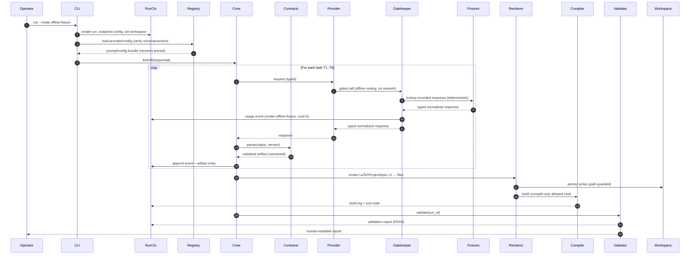
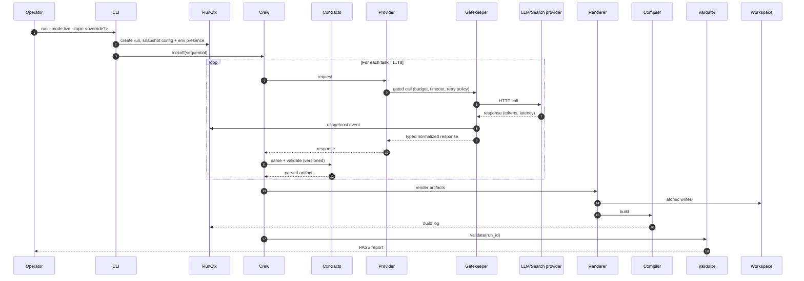
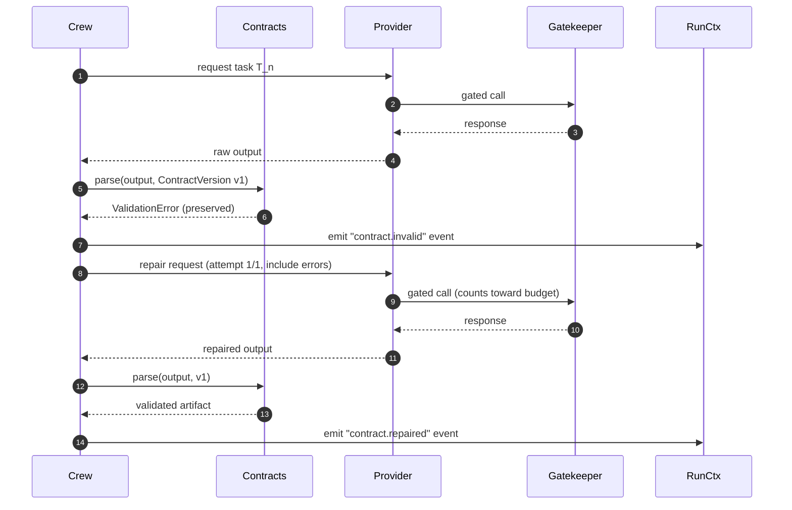
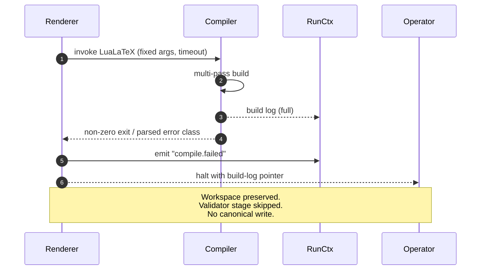
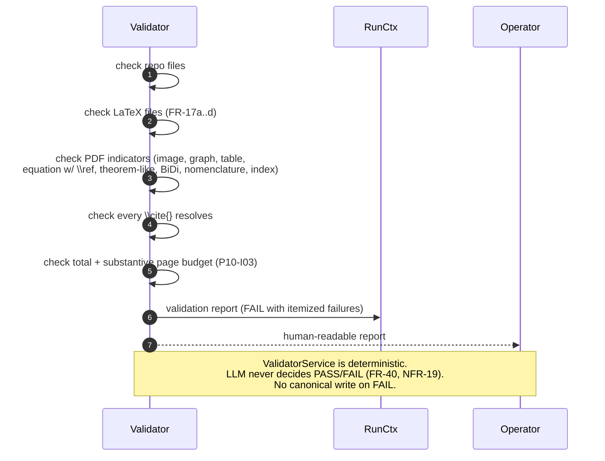
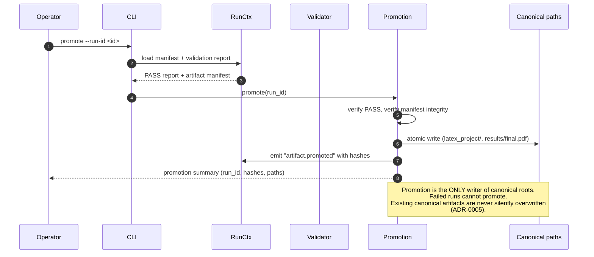

# Runtime sequence diagrams — agentic-publishing-pipeline

> **Status:** Phase 4 design amendment (P4-I04). Documentation-only.
> No runtime implementation exists yet; see `docs/PLAN.md` Phase 5
> onward for implementation phasing.

This document records the runtime sequences that the planned
implementation must follow. Each sequence is labelled with the
operational mode that triggers it (per
[`run_lifecycle.md`](run_lifecycle.md) §3).

The eight sequences below collectively satisfy the P4-I04 deliverable
"successful offline-fixture sequence; successful live sequence; invalid
output plus one bounded repair sequence; repair-exhaustion failure;
provider/budget rejection; LaTeX compilation failure; deterministic
validation failure; explicit artifact promotion."

Common participants:

- **Operator** — human launching the CLI.
- **CLI** — entry point in `src/agentic_publishing_pipeline/crews/`.
- **RunCtx** — `PipelineRunContext` (P5-I10).
- **Registry** — prompt/config registry (P5-I12).
- **Crew** — CrewAI sequential orchestration.
- **Contracts** — typed artifact-contract boundary (P5-I08).
- **Provider** — provider facade.
- **Gatekeeper** — API Gatekeeper (P5-I09).
- **Fixtures** — offline fixture store.
- **Renderer** — deterministic renderer + secure file I/O.
- **Compiler** — LaTeX build service.
- **Validator** — deterministic `ValidatorService`.
- **Promotion** — explicit promotion operation.
- **Workspace** — `results/<run_id>/`.

---

## Sequence 1 — Successful offline-fixture run

**Mode:** `offline-fixture`. No network, no API keys required, no paid
provider call. Deterministic fixture responses replace live LLM/search,
but **every call still flows through the API Gatekeeper** so that
request policy, accounting, and structured event emission remain
consistent with the live path (see
[ADR-0004](adrs/ADR-0004-provider-vs-gatekeeper.md) §"Offline fixtures
still flow through the Gatekeeper"). The Gatekeeper deterministically
routes the call to the fixture store instead of the network.



Offline-fixture invariants:

- **No external network request** is issued by any container.
- **No provider API key** is read or required.
- The **Gatekeeper still applies request policy** (budget accounting,
  retry classification — vacuously zero-cost — timeout, attempt
  identity) and emits a `usage.jsonl` event for every request with
  `mode=offline-fixture` and `estimated_cost=0`. Policy violations
  (e.g., a configured per-run request cap) are enforced identically to
  the `live` path.
- The Gatekeeper is the **only** component that may route a request to
  `Fixtures`; the provider facade never reads the fixture store
  directly.

---

## Sequence 2 — Successful live run

**Mode:** `live`. Real LLM/search calls routed through provider facade
and API Gatekeeper. Budgets, retries, timeouts enforced.



---

## Sequence 3 — Invalid agent output + one bounded repair (success)

**Mode:** any. Stage produces output that fails contract validation;
exactly **one** repair attempt is allowed
([ADR-0002](adrs/ADR-0002-typed-artifact-contracts.md)).



---

## Sequence 4 — Repair exhaustion (failure)

**Mode:** any. Repair attempt also fails contract validation; run halts
without silently degrading. No downstream stage runs on unvalidated
output.

```mermaid
sequenceDiagram
    autonumber
    participant Crew
    participant Contracts
    participant Provider
    participant RunCtx
    participant Operator

    Crew->>Provider: request task T_n
    Provider-->>Crew: raw output
    Crew->>Contracts: parse(output, v1)
    Contracts-->>Crew: ValidationError
    Crew->>Provider: repair request (1/1)
    Provider-->>Crew: raw output 2
    Crew->>Contracts: parse(output 2, v1)
    Contracts-->>Crew: ValidationError (preserved)
    Crew->>RunCtx: emit "contract.repair_exhausted"
    Crew-->>Operator: halt with actionable error (NFR-18)
    Note over Crew,Operator: Workspace preserved for inspection;<br/>no promotion; no canonical write.
```

---

## Sequence 5 — Provider / budget rejection

**Mode:** `live`. Gatekeeper rejects the call (budget exceeded,
timeout, classified non-retriable error). Provider facade does not
fall back silently to a different model or fixture.

```mermaid
sequenceDiagram
    autonumber
    participant Crew
    participant Provider
    participant Gatekeeper
    participant RunCtx
    participant Operator

    Crew->>Provider: request task T_n
    Provider->>Gatekeeper: gated call
    Gatekeeper->>Gatekeeper: check budget / classify error
    Gatekeeper->>RunCtx: emit "provider.rejected" usage event
    Gatekeeper-->>Provider: GatekeeperRejection
    Provider-->>Crew: GatekeeperRejection (typed)
    Crew->>RunCtx: emit "task.aborted"
    Crew-->>Operator: halt with reason (NFR-18)
    Note over Crew,Operator: No silent model swap;<br/>no silent offline fallback;<br/>no canonical write.
```

---

## Sequence 6 — LaTeX compilation failure

**Mode:** any after T7. Compiler returns non-zero exit code or
parses-build-log indicates a hard error. ValidatorService is not run;
no promotion occurs.



---

## Sequence 7 — Deterministic validation failure

**Mode:** any. Build succeeded but `ValidatorService` reports a
required-artifact, citation, page-budget, or BiDi failure.



---

## Sequence 8 — Explicit artifact promotion

**Mode:** `live` or `offline-fixture` after a PASS. Canonical artifacts
are never written by intermediate stages; they are produced only by an
explicit promotion command driven by the operator.



---

## Mode → sequence matrix

| Mode | Primary sequences |
|---|---|
| `dry-run` | Sequence 1 (no fixtures used; agents and tasks simulated; no file writes outside workspace) |
| `offline-fixture` | Sequences 1, 3, 4, 6, 7, 8 |
| `live` | Sequences 2, 3, 4, 5, 6, 7, 8 |
| `compile-only` | Sequences 6, 7 (skips T1–T8; consumes an existing run workspace) |
| `validate-only` | Sequence 7 (consumes an existing run workspace) |
| `resume` | Skips already-PASS stages; re-enters mid-pipeline at the first non-PASS stage (deferred to P5-I11 implementation) |
